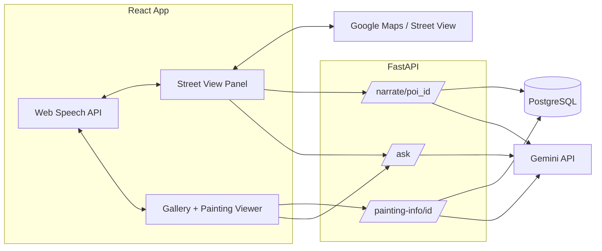

# PRD — Immersive AI Heritage & Art Experience
**ACM x MLH Hack Days 2026 · NMAMIT · Track 1 ("What is Earth without art?")**
**Team size:** 2 · **Build window:** 6 hours · **Gemini use:** compulsory

---

## 1. Problem Statement

Heritage and fine art are usually experienced as flat photos and plaques — informative but passive and easy to forget. We want people to *walk through* a real monument using Google Street View imagery, and *examine* famous paintings up close, with an AI guide that narrates and answers questions in both places.

## 2. Goals

- Let a user explore one real-world monument through real Street View imagery, guided automatically between a handful of points of interest (POIs).
- Let a user browse a small art gallery, open a painting into a zoom/rotate viewer, and get AI-narrated history.
- In both places, let the user ask a free-form question and get a grounded Gemini answer, by voice or text.
- Ship something that demos cleanly end-to-end in a 6-hour build with 2 people.

## 3. Non-Goals (for this build)

- Free-roam 3D walking (we use Street View's point-to-point navigation, not continuous movement).
- More than one monument, or more than 3–4 paintings.
- User accounts, saved progress, or multi-monument scaling (architecture should *allow* it later, but don't build it now).
- Mobile app — a responsive web app is enough.

## 4. Users & Core Flows

**Flow A — Monument walkthrough**
Enter → Street View panorama loads at the monument → guide auto-narrates and moves between 3–4 POIs → user can ask a question at any POI → guide answers, then continues the tour.

**Flow B — Art gallery**
Enter gallery → grid of 3–4 paintings → click a painting → viewer opens (zoom, pan, rotate-style orbit) → guide narrates its history → user can ask a question about it.

## 5. Feasibility Notes (read before building)

- **Street View** is embedded via the Maps JavaScript API's `StreetViewPanorama` — a few lines of code, not a custom renderer. It needs a Google Cloud project with **billing enabled** (a card on file) and an API key restricted to Maps JavaScript API. Free tier covers hackathon-scale usage, but **set this up before the clock starts**, not during.
- **Coverage must be verified in advance.** Not every monument (or its interior) has Street View imagery. Pick the monument and record working panorama coordinates/headings for each POI *before* hour 1.
- **"Walking"** means moving between fixed panorama points (`setPosition` / `setPov`), not free WASD movement — make sure the demo script matches this.
- **Paintings** should be public-domain scans (e.g. Wikimedia Commons) to avoid copyright issues.
- **"Rotate"** on a 2D painting is implemented as an orbit/tilt effect on a textured 3D plane (reusing Three.js), not a literal 3D painting.

## 6. Tech Stack

| Layer | Technology |
|---|---|
| Frontend framework | React + TypeScript or JavaScript |
| Monument view | Google Maps JavaScript API (`StreetViewPanorama`) |
| Gallery viewer | Three.js / React Three Fiber (textured plane + OrbitControls) |
| Styling | Tailwind CSS |
| Voice I/O | Browser Web Speech API (STT + TTS) |
| Backend | Python + FastAPI |
| AI | Google Gemini API |
| Database | PostgreSQL |
| Image assets | Public-domain painting scans (Wikimedia Commons) |
| Hosting (demo) | Local / localhost is fine for a hackathon demo |

## 7. Architecture



## 8. Data Model (PostgreSQL)

```sql
-- One row for the chosen monument
monuments (
  id, name, description, street_view_lat, street_view_lng
)

-- 3-4 POIs per monument, each tied to a panorama position
pois (
  id, monument_id, name, facts_text,
  pano_heading, pano_pitch, order_index
)

-- 3-4 paintings for the gallery
paintings (
  id, title, artist, year, facts_text, image_path
)
```

`facts_text` is the hand-written grounding context fed into Gemini's prompt — write this *before* the hackathon so prompt-building in hour 3 is just wiring, not research.

## 9. API Endpoints (FastAPI)

| Endpoint | Method | Purpose |
|---|---|---|
| `/monuments/{id}/pois` | GET | Return POI list + pano coordinates for the frontend |
| `/narrate/{poi_id}` | GET | Gemini narration grounded in that POI's facts |
| `/paintings` | GET | Return gallery list |
| `/painting-info/{painting_id}` | GET | Gemini narration grounded in that painting's facts |
| `/ask` | POST | Body: `{context_type, context_id, question}` → Gemini answer grounded in the relevant facts_text |

Reuse one `/ask` endpoint for both monument and gallery questions — just pass which context it's grounded in.

## 10. Pre-Hackathon Checklist (do this before hour 1)

- [ ] Google Cloud project created, billing enabled, Maps JavaScript API key generated and restricted
- [ ] Monument chosen and Street View coverage manually verified in Google Maps
- [ ] Panorama heading/pitch recorded for each of the 3–4 planned POIs
- [ ] 3–4 public-domain painting images downloaded, with title/artist/year noted
- [ ] Short facts written per POI and per painting (grounding text for Gemini)
- [ ] Gemini API key obtained and tested with a sample call

## 11. 6-Hour Implementation Plan

### Person A — Frontend
| Hour | Task |
|---|---|
| 1 | React app setup; embed `StreetViewPanorama` at the monument's start point; confirm navigation works |
| 2 | Add POI hotspots at recorded pano positions; clicking/auto-advance moves the view |
| 3 | Guided-tour logic (auto-move between POIs), caption UI, mic button, Web Speech API wiring |
| 4 | Connect to backend — call `/narrate/{poi_id}` on arrival, `/ask` on a question, play back response |
| 5 | Build gallery view — thumbnail grid, click opens Three.js plane + OrbitControls viewer (zoom/pan/orbit) |
| 6 | Connect gallery to `/painting-info/{id}` and `/ask`; polish both flows; rehearse |

### Person B — Backend / Data / AI
| Hour | Task |
|---|---|
| 1 | FastAPI setup; PostgreSQL schema; Gemini client config; help verify Street View coverage |
| 2 | Populate DB — POI facts + pano coordinates; painting metadata and facts |
| 3 | Build Gemini prompt templates: narration + contextual Q&A; test via curl/Postman |
| 4 | Expose `/narrate/{poi_id}`, `/painting-info/{id}`, `/ask`; basic error handling |
| 5 | Support Person A's gallery integration; stabilize failure cases (timeouts, empty responses) |
| 6 | Joint integration pass across both features; help prep demo script |

**Shared, last 20–30 minutes:** run the full demo twice, and **record a backup video** of a clean run — you're relying on Maps, Gemini, and venue wifi all working live at once.

## 12. Risks & Mitigations

| Risk | Mitigation |
|---|---|
| No Street View coverage for chosen monument | Verify before hour 1; have a backup monument shortlisted |
| Google Cloud billing setup takes longer than expected | Do it the night before, not during the hackathon |
| Gemini latency/rate limits live on stage | Pre-cache one narration response per POI/painting as a fallback |
| Venue wifi drops during judging | Record a backup demo video in advance |
| Scope runs long (2 features in 6 hours) | Monument walkthrough is the flagship — get it fully working before starting the gallery; cut the gallery to 2 paintings if hour 4 integration overruns |

## 13. Success Criteria (Demo-Ready Definition)

- A judge can watch the monument tour play from start to POI 3+ without manual intervention.
- A judge can ask one live question at a POI and get a relevant spoken/captioned answer.
- A judge can click into at least 2 paintings, zoom/rotate, and hear/read AI-generated history.
- The whole flow is still watchable from the backup video if any live API fails.
